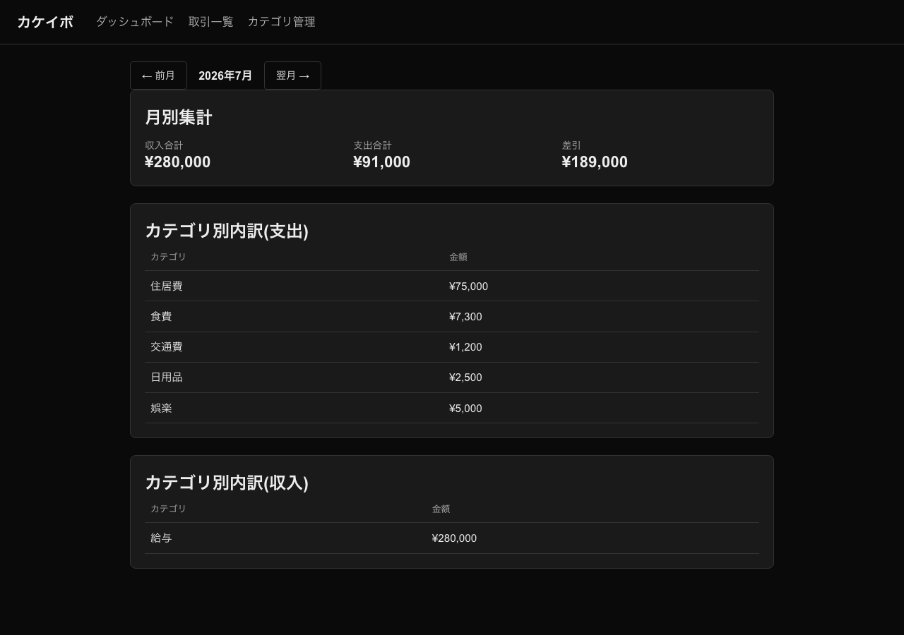
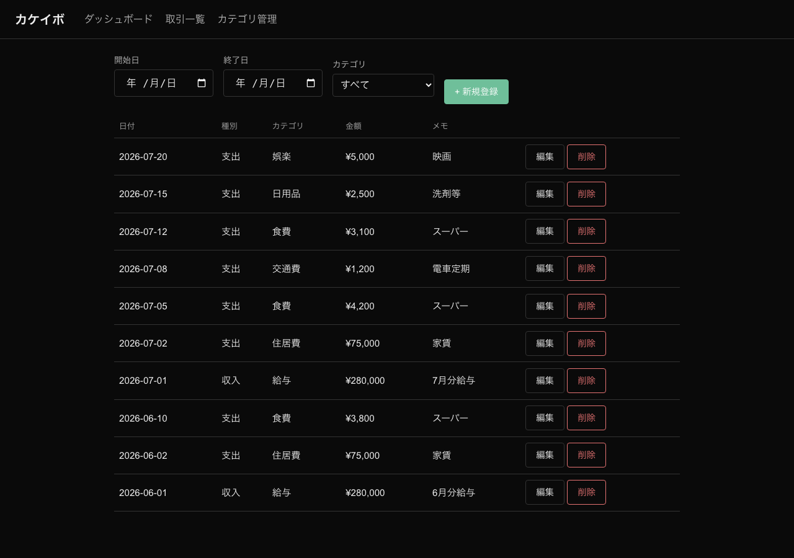
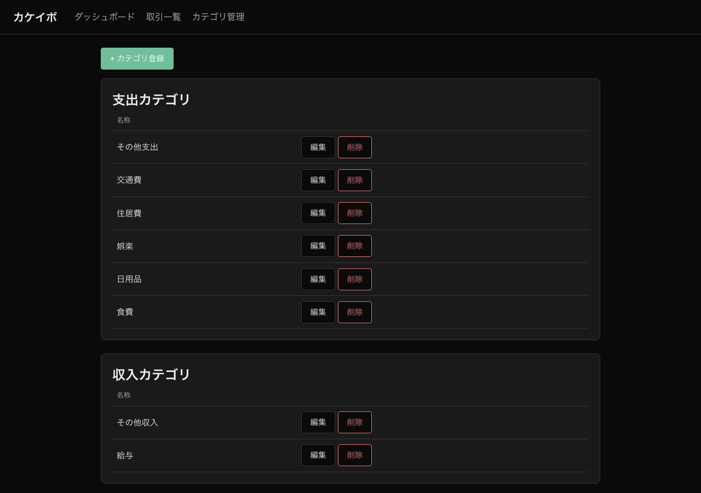

# カケイボ(家計簿アプリ)

収支の登録・カテゴリ分類・月別集計ができる、個人利用向けのシンプルな家計簿Webアプリケーション。
学校課題として、要件定義 → 開発 → AWSデプロイという実務と同じ流れで開発している
(詳細は[要件定義書](要件定義書.md)参照)。

## ドキュメント

| ドキュメント | 内容 |
|---|---|
| [要件定義書](要件定義書.md) | 背景・目的・検収基準など全体の合意事項 |
| [機能一覧](docs/機能一覧.md) | 機能要件とスコープ外項目 |
| [画面設計書](docs/画面設計書.md) | 画面一覧・画面構成要素・画面遷移 |
| [データベース設計書](docs/データベース設計書.md) | ER図・テーブル定義・保存形式 |
| [非機能要件定義書](docs/非機能要件定義書.md) | 動作環境・性能・ユーザビリティ・セキュリティ |
| [技術スタック](docs/技術スタック.md) | 使用技術とバージョン |
| [ローカル開発環境セットアップ](docs/ローカル開発環境セットアップ.md) | 開発環境の構築手順・サーバー起動方法 |
| [インフラ構成](docs/インフラ構成.md) | AWS上のインフラ構成図・ディレクトリ構成(Terraform管理) |

## 技術スタック(概要)

- フロントエンド: Next.js(TypeScript)
- バックエンド: Ruby on Rails(APIモード)
- データベース: MySQL(Dockerコンテナ)

前回開発したタスクボードアプリとは、フロントエンド・バックエンド・データベースを
すべて意図的に変更している。バージョンの詳細は[技術スタック](docs/技術スタック.md)を参照。

## 画面(AWS本番環境での実際の動作)



<details>
<summary>個別のスクリーンショット</summary>

**ダッシュボード(月別集計)**


**取引一覧(フィルタリング)**



**カテゴリ管理**



</details>

## できるようになったこと

このアプリを通じて、以下を実際に動くWebアプリケーションとして実装した。

- **収支の登録・カテゴリ分類・月別集計**: 収入/支出を日付・金額・カテゴリ・メモ付きで登録し、
  月ごとの収入合計・支出合計・差引を自動集計して表示する
- **日付・カテゴリでのフィルタリング**: 取引一覧を任意の期間・カテゴリで絞り込んで確認できる
- **集計処理でのSQL練習**: `JOIN` + `GROUP BY` + `SUM`によるサーバーサイド集計(月別集計・
  カテゴリ別集計)をRailsのActive Record経由で実装した(詳細は
  [データベース設計書](docs/データベース設計書.md)参照)
- **前回と全く異なる技術スタックでのフルスタック開発**: フロントエンド(Next.js/TypeScript)・
  バックエンド(Ruby on Rails API)・データベース(MySQL)を新たに使い、要件定義 → 実装 → AWSデプロイ
  という一連の流れを実践した
- **AWSへの実デプロイ**: EC2 + RDS(MySQL)構成をTerraformでコード化し、実際にAWS上で稼働させた
  (詳細は[インフラ構成](docs/インフラ構成.md)参照)

## ディレクトリ構成

```
.
├── 要件定義書.md
├── docs/                    # 各種設計ドキュメント
├── backend/                 # Ruby on Rails(APIモード)バックエンド
├── frontend/                # Next.js(TypeScript)フロントエンド
├── terraform/               # AWSインフラのコード化(EC2 + RDS)
├── docker-compose.yml       # ローカルMySQL起動用
└── docker-compose.prod.yml  # 本番(EC2)でのfrontend/backend起動用
```

## セットアップ・起動方法

前提条件や詳細な手順は[ローカル開発環境セットアップ](docs/ローカル開発環境セットアップ.md)を参照。

```bash
# MySQL起動
docker compose up -d

# バックエンド起動(別ターミナル)
cd backend
bin/rails db:migrate
bin/rails db:seed   # 初期カテゴリの投入(初回のみ)
bin/rails server -p 3001

# フロントエンド起動(別ターミナル)
cd frontend
npm install
npm run dev
```

起動後、`http://localhost:3000`で画面を確認できる。
`http://localhost:3001/up`でバックエンドの疎通確認ができる。

## 実装状況

- [x] リポジトリ作成・要件定義ドキュメント一式
- [x] 開発環境の初期構築(Rails API + Next.js + MySQLの疎通確認)
- [x] カテゴリ管理(登録・一覧・編集・削除。取引が紐づくカテゴリは削除不可)
- [x] 取引(収入/支出)の登録・編集・削除・一覧表示
- [x] 日付・カテゴリによるフィルタリング
- [x] 月別集計・カテゴリ別集計
- [x] AWS(EC2 + RDS)へのデプロイ
- [x] 画面録画・スクリーンショットの添付

## 開発ワークフロー

Issue登録・ブランチ運用・Pull Requestのルールは[CLAUDE.md](CLAUDE.md)を参照。
